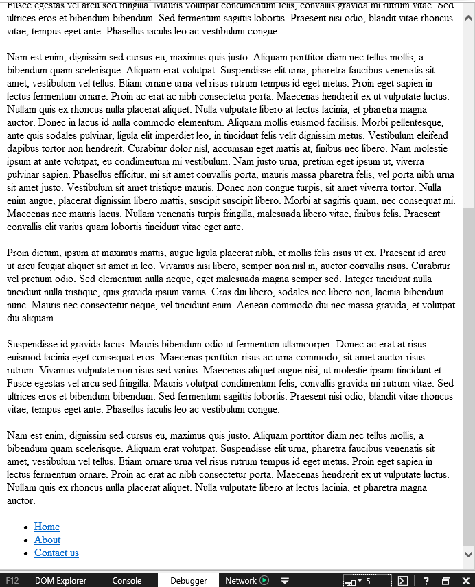
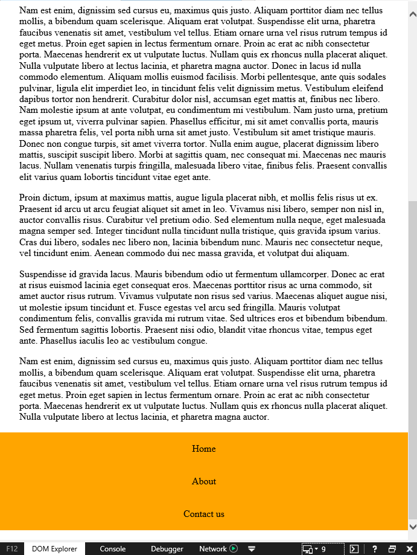

# Hamburger Menu Progressive Enhancement

[`link to demo`](https://cascuna.github.io/browser-technologies/opdracht2/hamburger-menu/)

note: outdated docs, will updated once feedback about code is positive

## preface
This assignment aims to recreate the hamburger principle using the progressive enhacement principle;
* The baseline
Available for everyone, should be as close to 100% support on browsers as possible, for the scope of this project we make the assumption that this means no javascript or css.

* Acceptable
This layer will add some styling, which doesn't have to be supported on every browser. For the scope of this project we make the assumption that this means CSS, but no javascript.

* Enjoyable
For the browsers that have javascript enabled with fetch can get the most enjoyable experience. In this stage we assume javascript/css/html is enabled.


## Baseline
**Coverage: 100% of the browsers**   
This is the core functionality of the assignment; when you click on the link, you will be taken to the navbar, which is at the bottom of the page in this scenario.
Screenshots are from tests on `internet explorer 11`, using the emulator to emulate `internet explorer 5`. I'll be making the assumption that if it works on this, it will work on basically anything.

### Stage 1


### Stage 2 (link has been clicked)


Since the core functionality of a hamburger menu is to take the user to the navigation, this seemed like a suitable solution for users without css or javascript.

## Acceptable
**Coverage: 98% will be able to see the functionality with media queriest**  
[media-queries](https://caniuse.com/#feat=css-mediaqueries)

Since CSS is available here, i'm using media queries to only show the hamburger menu if the screen size is smaller then 600px. If media queries aren't supported, the hamburger menu is shown by default.

### big screen


### Stage 1 small screen 

For smaller screens, the hamburger menu is available, now with a bit of styling to make it look more like a hamburger.


### Stage 2 small screen

The nav is also styled differently for small screens, putting the links underneath each other since this is easier for mobile users to use.


## Enjoyable
**Coverage: about 96%**
For this i'm doing quite a bit of feature detection to ensure all browsers can handle the script.
For example i'm using
```javascript
 var supportsAddEventListener = (burgerlink.addEventListener !== undefined)
```
To check if `addEventListener` is accepted, if not i'll use `element.onclick` as a supplement.
Further a-more i've implemented that function toggleClass
```javascript
 function toggleClass(element, newClass){
        console.log(element)
        console.log(element.clasNname)
        element.className === newClass ? element.className = '' : element.className = newClass
    }
```
Which simulates the `classlist` function `toggle`, but works for any browser.   
Last but not least i'm using 
```javascript 
 var navGetsLoaded = nav.childNodes.length != 0 ? true : false
```
as a way to detect if the nav is being filled (which implies this html 5 tag is supported). If it isn't, i'm using the UL 
instead. This was chosen over using a div or something, because i want to deliver semantic HTML if the browser
supports it :)


## Feedback
- [x] I'm working against the flow of my own HTML allot, which causes bugs like the nav sliding over the content
- [x] Text isn't semantic, no `<p>`'s
- [x] Not using feauture detection everywhere which causes the JS to break on older browsers
- [x] Style the A instead of the LI so stijn won't lose his mind next review 
