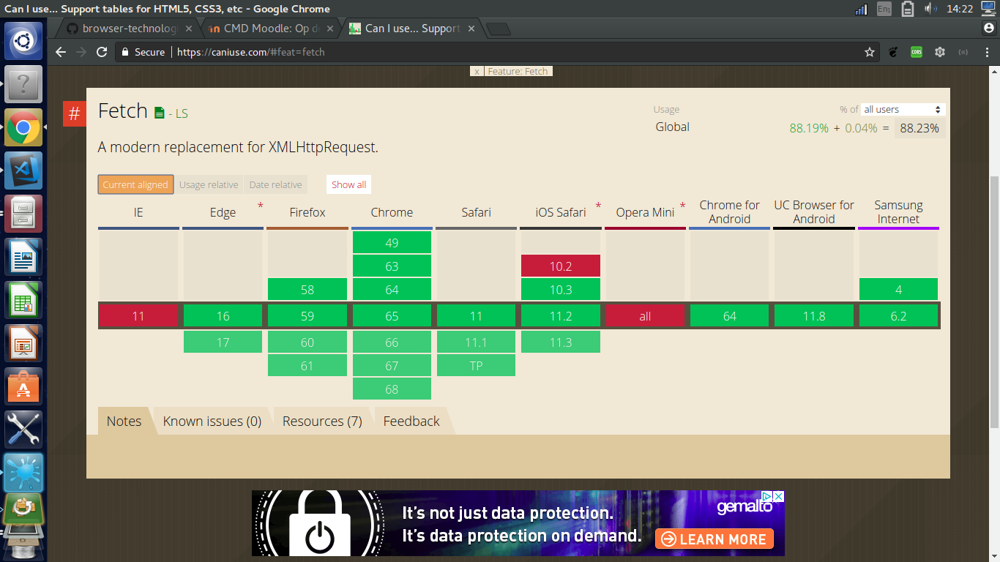
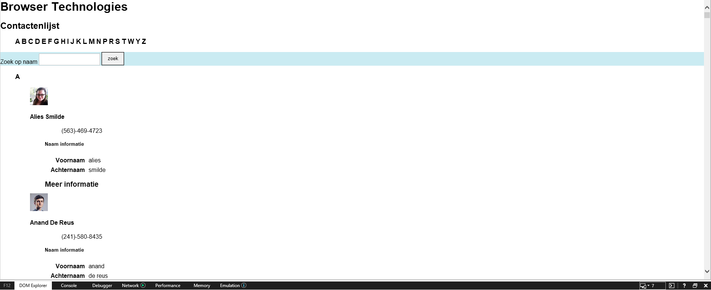
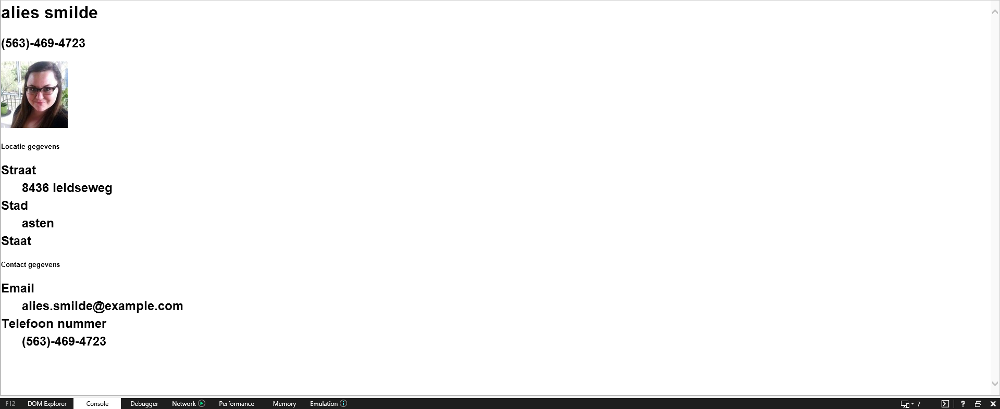
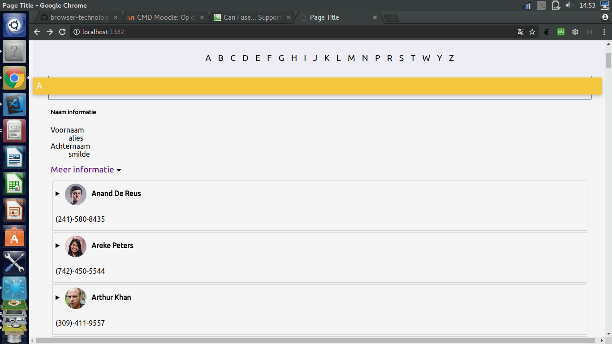
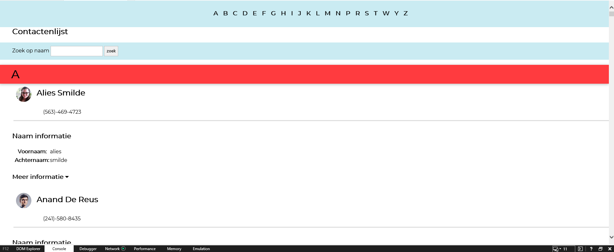
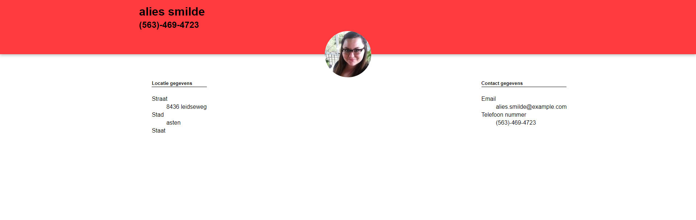
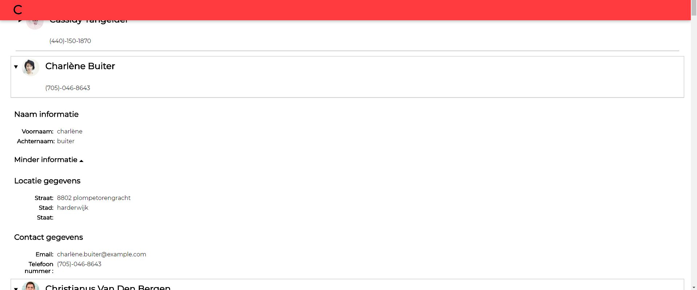

# Browser Technologies
Deze uitwerking is voor de opdracht: 
```
Ik wil in een lijst contacten kunnen filteren, en details kunnen bekijken
```

## Gebruikte api's
De contacten zijn opgehaald via: https://randomuser.me/  

## Installatie
1. `npm install`
2. `node app.js` 

## Functionaliteiten
### Kern functionaliteit
De kern van de applicatie is dat de gebruiker door een statische lijst van contacten kan kijken,en vervolgens meer details over de gebruiker kan zien op een afzonderlijke contact pagina. Ook het filteren zie ik hier als een kern functionaliteit, omdat het een belangerijk onderdeel is van een contactenboek. 


### Extra functionaliteiten & voor welke browsers is dit
Op het moment dat `fetch` ondersteund wordt in de browser, worden de filter resultaten & contactpagina op de pagina zelf gerenderd, om een "one-page" applicatie gevoel te creeren.

> Ondersteuning voor fetch 

Tevens zijn er verschillende animaties om de gebruiker te begeleiden door de website heen.

Verder wou ik graag speech-to-text, maar ben hier niet aan te gekomen. Hetzelfde geld voor een bel functie op mobiele apparaten.

## Baseline
Voor de baseline heb ik het getest in IE7, waar veel grafische componenten uit vallen, zodat ik kan zien hoe de gebruikers met erg oude browsers de website ervaren. 


Omdat de zoek functie via de back-end wordt opgelost, kan de gebruiker ook de zoek functionaliteit in IE7 gebruiken.


Ook de contact pagina werkt goed genoeg voor IE7, waardoor de eenvoudig data van de gebruiker kan zien


## Acceptable

In browsers zoals chrome/firefox wordt details ondersteund

Getest in ie11  
In ie wordt details standaard uitgeklapt, ongeacht welke versie. Wel ziet de layout er eens tuk beter uit.  


De gebruikers pagina ziet er nu een stuk "pleasureable" uit

## Pleasureable
Dit is waar de website getransformeert wordt in 1 page applicatie.  
De zoek resultaten worden automatisch in de dom geladen. Hetzelfde gebeurt voor de extra informatie van de gebruiker
