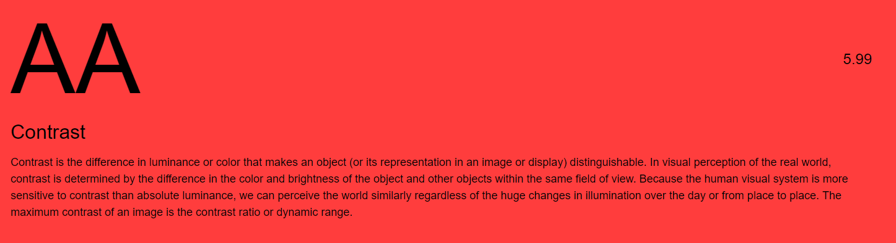
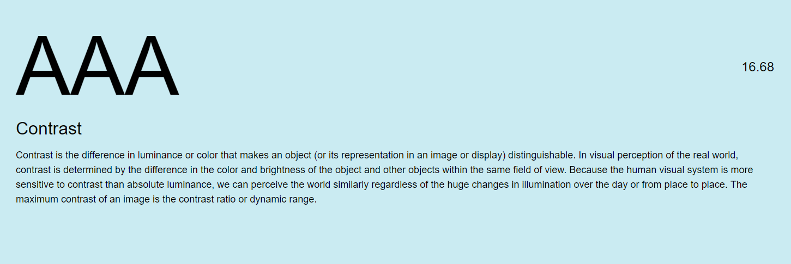

# Browser Technologies
 Link: https://opdracht3-bnrhkbhyow.now.sh/

Deze uitwerking is voor de opdracht: 
```
Ik wil in een lijst contacten kunnen filteren, en details kunnen bekijken
```

## Table of contents
- [Browser Technologies](#browser-technologies)
    - [Table of contents](#table-of-contents)
    - [Feedback](#feedback)
    - [Gebruikte api's](#gebruikte-apis)
    - [Installatie](#installatie)
    - [Kleurenstudie](#kleurenstudie)
    - [Functionaliteiten](#functionaliteiten)
        - [Kern functionaliteit](#kern-functionaliteit)
        - [Extra functionaliteiten & voor welke browsers is dit](#extra-functionaliteiten-voor-welke-browsers-is-dit)
        - [Wishlist](#wishlist)
    - [Baseline](#baseline)
    - [Acceptable](#acceptable)
    - [Pleasureable](#pleasureable)

## Feedback
* op alle elementen scroll-behavior: smooth

## Gebruikte api's
De contacten zijn opgehaald via: https://randomuser.me/  

## Installatie
1. `npm install`
2. `npm start` 

## Kleurenstudie
Als kleuren palette heb ik voor wat vriendelijkere, maar vleurige kleuren gekozen. 
Voor de kleuren heb ik een kleur studie gedaan:
> Letter header kleur paar
  
Omdat de kleuren combinatie AA is, heb ik voor een grotere font-size gekozen, zodat het alsnog goed te lezen is.

> Voor de filter/zoek opties heb ik voor een lichtere tint blauw gekozen
  
Deze combinatie is wat dat betreft erg goed, en zou makkelijk te lezen moeten zijn 

## Functionaliteiten
### Kern functionaliteit
De kern van de applicatie is dat de gebruiker door een (mogelijk dynamische) lijst van contacten kan kijken, en vervolgens meer details over de gebruiker kan zien op een afzonderlijke contact pagina. Ook het filteren zie ik hier als een kern functionaliteit, omdat het een belangerijk onderdeel is van een contactenboek. 


### Extra functionaliteiten & voor welke browsers is dit
Op het moment dat `fetch` ondersteund wordt in de browser, worden de zoek resultaten & contactpagina op de pagina zelf gerenderd, om een "one-page" applicatie gevoel te creeren.

> Ondersteuning voor fetch 

Tevens zijn er verschillende animaties om de gebruiker te begeleiden door de website heen.


### Wishlist
- Text to speech om mensen met disabilities een makkelijkere interface voor gebruik te geven. 
- Bel functie. Alhoewel dit vrijwel cruciaal is in een contactenlijst, is het niet opgenomen in het design i.v.m. tijdsgebrek.

Verder wou ik graag speech-to-text, maar ben hier niet aan te gekomen. Hetzelfde geld voor een bel functie op mobiele apparaten.

## Baseline
> Ik verwacht dat dit product in 100% van de gevallen beschikbaar is.
Voor de baseline heb ik het getest in IE7, waar veel grafische componenten uit vallen, zodat ik kan zien hoe de gebruikers met erg oude browsers de website ervaren. 


Omdat de zoek functie via de back-end wordt opgelost, kan de gebruiker ook de zoek functionaliteit in IE7 gebruiken.


Ook de contact pagina werkt goed genoeg voor IE7, waardoor de eenvoudig data van de gebruiker kan zien


## Acceptable
> Ik verwacht dat dit product in 85%+ van de gevallen beschikbaar is.

In browsers zoals chrome/firefox wordt details ondersteund

Getest in ie11  
In ie wordt details standaard uitgeklapt, ongeacht welke versie. Wel ziet de layout er eens tuk beter uit.  


De gebruikers pagina ziet er nu een stuk "pleasureable" uit

## Pleasureable
> Ik verwacht dat deze versie  70%+ van de gevallen beschikbaar is.
Dit is waar de website getransformeert wordt in 1 page applicatie.  
De zoek resultaten worden automatisch in de dom geladen. Hetzelfde gebeurt voor de extra informatie van de gebruiker
